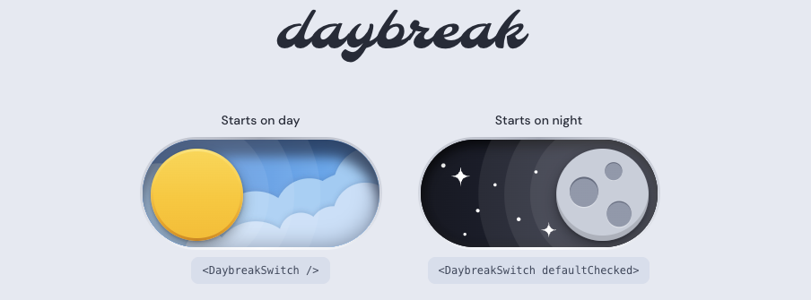

<p align="center">
  
</p>

An animated day/night switch for React. Purely CSS-driven with inline SVGs, no animation library, no image assets.

Under the hood it is a single `<button role="switch">`, so it keyboards and screen-reads like a checkbox.

[Try it live](https://james-gulland.github.io/daybreak-switch/)

## Try it locally

```bash
npm install
npm run dev
```

## Using it in your own project

There is no npm package. Copy the folder:

```
src/components/DaybreakSwitch/
├── DaybreakSwitch.tsx
├── DaybreakSwitch.css
└── index.ts

```

The component imports its own CSS, so nothing else to wire up. It needs React 18 or newer and a bundler that can import a `.css` file from a module, which Vite, Next.js and Create React App all do.

```tsx
import { DaybreakSwitch } from "./components/DaybreakSwitch";

function Header() {
  return <DaybreakSwitch defaultChecked={false} />;
}
```

## Props

All props are optional.

| Prop              | Type                         | Default       | What it does                                                                                                  |
| ----------------- | ---------------------------- | ------------- | ------------------------------------------------------------------------------------------------------------- |
| `checked`         | `boolean`                    | —             | Controlled value. `true` is night, `false` is day. Passing it puts the switch in controlled mode.             |
| `defaultChecked`  | `boolean`                    | `false`       | Starting value when uncontrolled. Ignored if `checked` is set.                                                |
| `onChange`        | `(checked: boolean) => void` | —             | Fires with the new value on every toggle, in both modes.                                                      |
| `size`            | `number`                     | `120`         | Track height in px. Width is `size * 2.2`, and the knob, padding, shadows and halo rings all scale from it.   |
| `disabled`        | `boolean`                    | `false`       | Blocks clicks, sets the button's `disabled` attribute, drops opacity to 0.6 and shows a `not-allowed` cursor. |
| `className`       | `string`                     | —             | Appended to the root class, for margins or a size override.                                                   |
| `id`              | `string`                     | —             | Forwarded to the button. Use with a visible `<label htmlFor>`. Suppresses the default `aria-label`.           |
| `aria-label`      | `string`                     | `'Dark mode'` | Accessible name when there is no visible label. Not applied if `id` or `aria-labelledby` is set.              |
| `aria-labelledby` | `string`                     | —             | Id of a visible label. Wins over `aria-label`.                                                                |

The props type is exported too:

```ts
import type { DaybreakSwitchProps } from "./components/DaybreakSwitch";
```

## Controlled and uncontrolled

Leave `checked` off and the switch keeps its own state. Use `onChange` if you want to hear about it:

```tsx
<DaybreakSwitch defaultChecked onChange={night => console.log(night)} />
```

Pass `checked` and you own the state. The switch renders what you give it and will not move on its own, so you have to handle `onChange`:

```tsx
const [dark, setDark] = useState(false);

<label htmlFor="theme-switch">Dark mode</label>
<DaybreakSwitch id="theme-switch" checked={dark} onChange={setDark} size={32} />
```

Wiring it to a real theme usually looks like this:

```tsx
const [dark, setDark] = useState(() => window.matchMedia("(prefers-color-scheme: dark)").matches);

useEffect(() => {
  document.documentElement.dataset.theme = dark ? "dark" : "light";
}, [dark]);

return (
  <>
    <label htmlFor="theme-switch">Dark mode</label>
    <DaybreakSwitch id="theme-switch" checked={dark} onChange={setDark} />
  </>
);
```

## Sizing

`size` sets the CSS variable `--h` on the root element, and every other measurement is a `calc()` from it. So one number changes the whole thing, and it stays sharp at any size because nothing is a bitmap.

It looks best somewhere between 28px and 160px. Below about 24px the moon craters and stars get too small to read. The clickable area is expanded to 44×44 CSS pixels when `size` is smaller than that, so a 32px switch still meets the usual touch-target guidance.

You can also set `--h` from your own stylesheet instead of passing `size`, which is handy for responsive sizes:

```css
.my-switch {
  --h: 32px;
}

@media (min-width: 768px) {
  .my-switch {
    --h: 48px;
  }
}
```

```tsx
<DaybreakSwitch className="my-switch" />
```

## Timing

Two more variables control the animation, both on `.dn-switch`:

- `--dur`, default `600ms`
- `--ease`, default `cubic-bezier(0.45, 0.05, 0.2, 1)`

Override them the same way:

```css
.my-switch {
  --dur: 350ms;
}
```

Under `prefers-reduced-motion: reduce` the CSS sets `--dur: 0ms`, so the switch snaps between states instead of animating. That is handled for you.

## Colours

The switch palette is declared together at the top of the `.dn-switch` rule in `DaybreakSwitch.css`. Solid colours use perceptually uniform OKLCH values, while related transparent shadows and highlights are derived from shared white, black and ink tokens. The more detailed sky and sun palettes are consolidated into `--dn-gradient-*` tokens.

Override only the colours you need on a custom class:

```css
.my-switch {
  --dn-gradient-day-sky: linear-gradient(90deg, oklch(62% 0.18 285), oklch(82% 0.1 285));
  --dn-color-cloud-back: oklch(88% 0.06 285);
  --dn-color-cloud-front: oklch(94% 0.03 285);
}
```

Because the variables live on the component root, different switch instances can use different palettes. The demo page's own `--page-color-*`, `--control-color-*` and `--focus-color-*` variables are grouped in `src/index.css`.

The root element carries `data-state="day"` or `data-state="night"`, which is what all the state-dependent rules key off. Useful if you want to add your own.

## Accessibility

- Renders `<button type="button" role="switch">` with `aria-checked` tracking state, so it is reachable by Tab and toggles on Space or Enter.
- Prefer a visible `<label htmlFor>` (or `aria-labelledby`). Without one, `aria-label` defaults to `'Dark mode'`.
- Focus ring is a dark outline plus a light halo on `:focus-visible`, so it stays visible on light, dark, and blue surfaces, and only for keyboard users.
- Under `forced-colors: active` (Windows High Contrast) the decorative skies hide and the track/thumb use system colours.
- Honours `prefers-reduced-motion`.
- The SVG scenery is `aria-hidden`. Cloud filter ids are unique per instance.

## Notes and limits

- No drag support. Click and keypress only.
- Not a form control. There is no hidden `<input>`, so it will not submit a value with a form. Wrap it or add your own input if you need that.
- `all: unset` on the root resets inherited button styles, so a global button rule in your app will not leak in.
